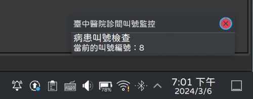

# 臺中醫院診間叫號監控

抓取並透過桌面通知呈現臺中醫院診間的當前叫號，方便掌握病患現場等候時機

<https://gitlab.com/brlin/taichung-hospital-consultation-room-called-patient-number-monitoring>  
 [狀態")](https://github.com/brlin-tw/taichung-hospital-consultation-room-called-patient-number-monitoring/actions/workflows/check-potential-problems.yml)  

[English](README.md) | 台灣中文

## 注意事項

在使用本應用軟體前請注意：

* 本解決方案僅獲取叫號機的叫號資訊，病患仍須遵守醫院診間規定完成報到作業以免失去求診資格
* 請合理設定本工具的輪詢行為，避免讓醫院方資訊系統過載
* 這**不是**臺中醫院的官方產品，產品作者**無法**且**不會**對任何因本產品的使用所衍生的任何損失進行賠償

## 前備條件

本應用軟體需要下列軟體的存在以使其能夠正常運行：

* 一個運行相容於 [Desktop Notifications Specification](https://specifications.freedesktop.org/notification-spec/notification-spec-latest.html) 通知服務器（內建或是外部啟動）的桌面環境
* [libnotify](https://gitlab.gnome.org/GNOME/libnotify)  
  用於提供 `notify-send` 命令
* [curl](https://curl.se/)  
  用於發送 HTTP 請求至醫院的診間叫號網站
* [orf/html-query: jq, but for HTML](https://github.com/orf/html-query)  
  用於解析醫院診間叫號網頁並將其結果轉換為 JSON 資料
* [jqlang/jq: Command-line JSON processor](https://github.com/jqlang/jq)  
  用於解析 html-query 傳回的 JSON 資料並轉換為簡單字串
* [gettext](https://www.gnu.org/software/gettext/)  
  用於軟體的國際化(I18N)支援
* [Coreutils - GNU core utilities](https://www.gnu.org/software/coreutils/)  
  用於提供 `realpath` 與 `sleep` 命令
* [Bash](https://www.gnu.org/software/bash/)  
  用於運行監控程序

## 可以變更監控程序行為的環境變數

以下環境變數可以根據使用者需求變更監控程序的行為：

### CHECK_INTERVAL_BASE

監控輪詢的基底週期（單位：秒）

預設值： `15`

### CHECK_INTERVAL_VARIANCE_MAX

為監控輪詢週期賦予隨機性的週期變動量最大值（單位：秒）

每次的輪詢的確切週期為 `CHECK_INTERVAL_BASE` + （隨機數 % `CHECK_INTERVAL_VARIANCE_MAX` + 1） 秒

預設值： `10`

### CHECK_URL

要監控的臺中醫院個別診間看診進度頁面，瀏覽[臺中醫院網路掛號系統的看診進度功能](https://www03.taic.mohw.gov.tw/RegMobileWeb/Home/RegRoomList?Flag=Y)，選好科別跟醫師後可以看到「目前看到」欄位的那個頁面的網址

預設值：（無）  
範例值： `https://example.taic.mohw.gov.tw/RegMobileWeb/Home/RegRoom?cateId=1234&drId=5678`

### CHECK_TIMEOUT

監控發起的 HTTP 請求的超時時間（單位：秒）

對應 curl 軟體的 `--max-time` 命令選項

預設值： `30`

## 參考資料

* [看診進度](https://www03.taic.mohw.gov.tw/RegMobileWeb/Home/RegRoomList?Flag=Y)  
  臺中醫院的看診進度查詢頁面
* curl(1) 的 manpage 使用手冊頁面  
  說明 curl HTTP 客戶端工具的使用方式
* xgettext(1) 的 manpage 使用手冊頁面  
  說明如何使用 `xgettext` 命令自來源程式碼檔案中抽取出可以被翻譯的字串
* msginit(1) 的 manpage 使用手冊頁面  
  說明如何使用 `msginit` 命令自 POT 範本檔案產生新的 PO <ruby>訊息目錄<rp>(</rp><rt>message catalog</rt><rp>)</rp></ruby>檔案
* msgfmt(1) 的 manpage 使用手冊頁面  
  說明如何使用 `msgfmt` 命令將訊息目錄檔案編譯為二進位格式
* notify-send(1) 的 manpage 使用手冊頁面  
  說明如何使用 `notify-send` 命令發送<ruby>桌面通知<rp>(</rp><rt>desktop notification</rt><rp>)</rp></ruby>
* [Basic Design - Desktop Notifications Specification](https://specifications.freedesktop.org/notification-spec/notification-spec-latest.html#basic-design)  
  說明 Linux 桌面環境中桌面通知的基本概念
* [Files - Fields - Machine-readable debian/copyright file](https://www.debian.org/doc/packaging-manuals/copyright-format/1.0/#files-field)  
  說明如何指定 REUSE DEP5 檔案 Files 欄位的檔案吻合式樣

## 授權條款

除了另外註明之內容外（個別檔案標頭、[REUSE DEP5 檔案](.reuse/dep5)），本產品以 [Creative Commons Attribution-ShareAlike 授權條款第 4.0 國際版](https://creativecommons.org/licenses/by-sa/4.0/)或您所偏好之更近期版本釋出供大眾於_授權範圍_內自由使用。

本作品遵循 [REUSE 規範](https://reuse.software/spec/)，參閱 [REUSE - Make licensing easy for everyone](https://reuse.software/) 網站以了解關於本產品授權的相關資訊。
